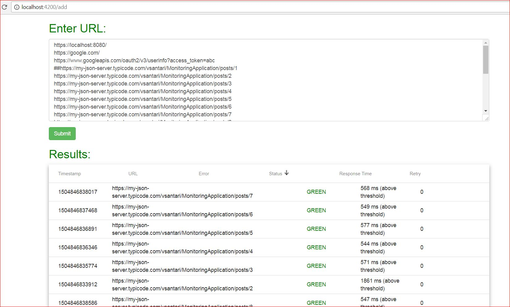

# Url Monitoring App

This application is created using the Angular(client) and Spring(server). This application will check the URL if the response status is 200 and content contains the phrase “Component Status: GREEN”. After checking it, 
it will report the results in the table.

## Running server
* Change directory to `cd server-spring`
* Build spring `./gradlew build`
* Start server `./gradlew bootRun`

## Running client
* Change directory to `cd client-angular`
* Install npm `npm install`
* Start angular client `npm start`
* Navigate to `http://localhost:4200/`

## Sample URL strings
* https://localhost:8080/
* https://google.com/
* https://www.googleapis.com/oauth2/v3/userinfo?access_token=abc
* https://my-json-server.typicode.com/vsantari/MonitoringApplication/posts/1##
* https://my-json-server.typicode.com/vsantari/MonitoringApplication/posts/2
* https://my-json-server.typicode.com/vsantari/MonitoringApplication/posts/3
* https://my-json-server.typicode.com/vsantari/MonitoringApplication/posts/4
* https://my-json-server.typicode.com/vsantari/MonitoringApplication/posts/5
* https://my-json-server.typicode.com/vsantari/MonitoringApplication/posts/6
* https://my-json-server.typicode.com/vsantari/MonitoringApplication/posts/7
* https://my-json-server.typicode.com/vsantari/MonitoringApplication/posts/8
* https://my-json-server.typicode.com/vsantari/MonitoringApplication/posts/9
* https://my-json-server.typicode.com/vsantari/MonitoringApplication/posts/10
* https://my-json-server.typicode.com/vsantari/MonitoringApplication/posts/11
* https://my-json-server.typicode.com/vsantari/MonitoringApplication/posts/12
* https://my-json-server.typicode.com/vsantari/MonitoringApplication/posts/13
* https://my-json-server.typicode.com/vsantari/MonitoringApplication/posts/14
* https://my-json-server.typicode.com/vsantari/MonitoringApplication/posts/15
* https://my-json-server.typicode.com/vsantari/MonitoringApplication/posts/16
* https://my-json-server.typicode.com/vsantari/MonitoringApplication/posts/17
* https://my-json-server.typicode.com/vsantari/MonitoringApplication/posts/18
* https://my-json-server.typicode.com/vsantari/MonitoringApplication/posts/19
* https://my-json-server.typicode.com/vsantari/MonitoringApplication/posts/20
